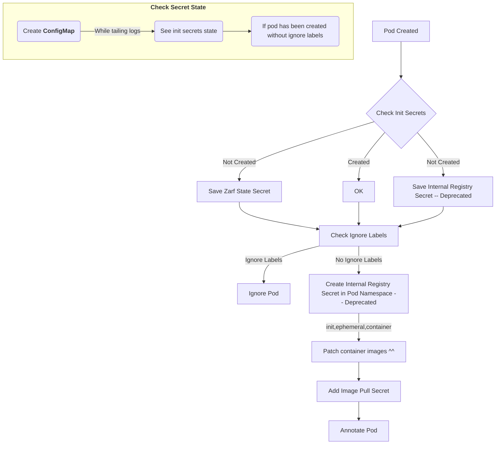

# Pepr Module

- [High Level Overview](#high-level-overview)
- [Check List](#check-list)
- [Full e2e Demo](#full-e2e-demo)
- [Demo](#demo)
- [Unit Test](#unit-test)
- [Fast Restart](#fast-restart)
- [Lint](#lint)
- [Contributing](#contributing)
- [Developing](#developing)

## High Level Overview



## Check List

Step 1: (Initialization Phase)

- [x] Get Zarf State from secret and store in state
- [x] Get private-registry secret and store in state (Helm PostRenderer does this -- Deprecated)

Step 2: (Pre-Mutation Phase)

- [x] Get Pod without ignore labels/annotations
- [x] Deploy private-registry secret to pod namespace

Step 3: (Mutation Phase)

- [x] Mutate pod with imagePullSecret
- [x] Mutate pod with internal registry image
- [x] Annotate pod `zarg-agent: patched`

Step 4: Implement transform pkg for TypeScript with Tests

- [x] Images

## Full e2e Demo

> In this e2e demo we will create a custom Zarf 'init' package that excludes the zarf-agent. We will then create a kind cluster and install Zarf. We will then deploy a zarf package for `hello-zarf` and check that the pod has the imagePullSecret, the internal registry image, and the application is working properly.

Create the cluster.

```bash
kind create cluster --name=pepr-zarf-agent
```

Clone this repo with custom init package.

```bash
WORKING_DIR=$(pwd)
cd /tmp
git clone -b pepr-zarf-agent-e2e https://github.com/cmwylie19/zarf
cd zarf
```

Read the Zarf Custom 'init' Package to see that the zarf-agent is commented out.

```bash
cat zarf.yaml | egrep -A 3 -B 1 'name: zarf-agent' 
```

output 

```bash
 # Creates the pod+git mutating webhook
  # - name: zarf-agent
  #   required: true
  #   import:
  #     path: packages/zarf-agent
```

Create, deploy the custom init package.

```bash
zarf package create --confirm
zarf package deploy zarf-init* --confirm
```

Check that there is no zarf-agent running in Zarf namespace.

```bash
kubectl get po -n zarf
```

output

```bash
NAME                                    READY   STATUS    RESTARTS   AGE
zarf-docker-registry-549c64ccb5-dvwd2   1/1     Running   0          9s
```

Deploy the Pepr Zarf Agent Kube Manifests and wait for pods to be in `READY` state.

```bash
kubectl create -f $WORKING_DIR/dist
kubectl wait --for=condition=Ready pod -l app -n pepr-system --timeout=180s;
```

Clone `hello-zarf` repo, create and deploy the `hello-zarf` package.

```bash
# back to /tmp
cd ..
git clone https://github.com/cmwylie19/hello-zarf.git
cd hello-zarf
zarf package create k8s --confirm
zarf package deploy zarf-package-k8s-manifests* --confirm
```

Check that the pod has the imagePullSecret, the internal registry image, annotation and the application is working properly.

```bash
kubectl get po -n webserver -oyaml | egrep -A2 -b2 'imagePullSecret|patched|image'
```

output 

```bash
63-    annotations:
80-      f64b6d4f-93ec-54d3-99a4-e70c751da008.pepr.dev/zarf-agent: succeeded
154:      zarg-agent/dev: patched
184-    creationTimestamp: "2023-06-27T15:29:59Z"
230-    generateName: hello-zarf-c558dd559-
--
703-    - command:
718-      - ./hello-zarf
739:      image: 127.0.0.1:31999/cmwylie19/hello-zarf:latest-zarf-4234714594
812:      imagePullPolicy: Always
842-      name: hello-zarf
865-      resources: {}
--
1117-    dnsPolicy: ClusterFirst
1145-    enableServiceLinks: true
1174:    imagePullSecrets:
1196-    - name: private-registry
1225-    nodeName: pepr-zarf-agent-control-plane
--
2767-    containerStatuses:
2790-    - containerID: containerd://64d52516875ed3058a6bb0d018db404a35eaae462d8defda72c5dcc204446c26
2887:      image: 127.0.0.1:31999/cmwylie19/hello-zarf:latest-zarf-4234714594
2960:      imageID: 127.0.0.1:31999/cmwylie19/hello-zarf@sha256:29b4b88b5728e440edd0d9b56b8f6204caf07281b5feb75c4f691b8425b1a929
3084-      lastState: {}
3104-      name: hello-zarf
```

Curl the application to ensure it is working properly

```bash
kubectl run curler --image=nginx --restart=Never -l zarf.dev/agent=ignore --rm -it -- curl -s hello-zarf.webserver.svc.cluster.local:8081
```

expected output:

```bash
Let's kick Zarf's tires!🦄pod "curler" deleted
```

Clean Up

```bash
cd $WORKING_DIR
kind delete cluster --name=pepr-zarf-agent
rm -rf /tmp/zarf /tmp/hello-zarf
```

## Demo

_This flow creates a namespace, create a new pod in the namespace, and then checks the pod for the imagePullSecret and the internal registry image, and looks at the imagePullSecret._

**To test w/out Zarf uncomment everything under `Uncomment for testing w/out Zarf` in the zarf-agent and rebuild and redeploy**

```bash
┌─[cmwylie19@Cases-MacBook-Pro] - [~/pepr-zarf-agent] - [2023-06-26 09:55:12]
└─[0] <git:(tree-shake 0f8d000✱✈) > k create ns new-ns
namespace/new-ns created
┌─[cmwylie19@Cases-MacBook-Pro] - [~/pepr-zarf-agent] - [2023-06-26 09:55:19]
└─[0] <git:(tree-shake 0f8d000✱✈) > k run new-po -n new-ns --image=nginx
pod/new-po created
┌─[cmwylie19@Cases-MacBook-Pro] - [~/pepr-zarf-agent] - [2023-06-26 09:56:25]
└─[0] <git:(tree-shake 0f8d000✱✈) > k get po new-po -n new-ns -oyaml | egrep -A2 -b2 'imagePullSecret|patched|image'
35-  annotations:
50-    f64b6d4f-93ec-54d3-99a4-e70c751da008.pepr.dev/zarf-agent: succeeded
122:    zarg-agent/dev: patched
150-  creationTimestamp: "2023-06-26T13:56:25Z"
194-  labels:
--
324-spec:
330-  containers:
344:  - image: 127.0.0.1:31999/library/nginx
385:    imagePullPolicy: Always
413-    name: new-po
430-    resources: {}
--
668-  dnsPolicy: ClusterFirst
694-  enableServiceLinks: true
721:  imagePullSecrets:
741-  - name: private-registry
768-  nodeName: kind-control-plane
--
2342-    type: PodScheduled
2365-  containerStatuses:
2386:  - image: 127.0.0.1:31999/library/nginx
2427:    imageID: ""
2443-    lastState: {}
2461-    name: new-po
┌─[cmwylie19@Cases-MacBook-Pro] - [~/pepr-zarf-agent] - [2023-06-26 09:56:30]
└─[0] <git:(tree-shake 0f8d000✱✈) > k apply -f -<<EOF
apiVersion: v1
kind: Pod
metadata:
  creationTimestamp: null
  labels:
    run: initpo
  name: initpo
  namespace: new-ns
spec:
  initContainers: 
  - name: init
    image: nginx
  containers:
  - image: nginx
    name: container
    resources: {}
  dnsPolicy: ClusterFirst
  restartPolicy: Always
status: {}
EOF

pod/initpo created
┌─[cmwylie19@Cases-MacBook-Pro] - [~/pepr-zarf-agent] - [2023-06-26 09:56:46]
└─[0] <git:(tree-shake 0f8d000✱✈) > k get po initpo -n new-ns -oyaml | egrep -A2 -b2 'imagePullSecret|patched|image'
50-    f64b6d4f-93ec-54d3-99a4-e70c751da008.pepr.dev/zarf-agent: succeeded
122-    kubectl.kubernetes.io/last-applied-configuration: |
178:      {"apiVersion":"v1","kind":"Pod","metadata":{"annotations":{},"creationTimestamp":null,"labels":{"run":"initpo"},"name":"initpo","namespace":"new-ns"},"spec":{"containers":[{"image":"nginx","name":"container","resources":{}}],"dnsPolicy":"ClusterFirst","initContainers":[{"image":"nginx","name":"init"}],"restartPolicy":"Always"},"status":{}}
526:    zarg-agent/dev: patched
554-  creationTimestamp: "2023-06-26T13:56:46Z"
598-  labels:
--
728-spec:
734-  containers:
748:  - image: 127.0.0.1:31999/library/nginx
789:    imagePullPolicy: Always
817-    name: container
837-    resources: {}
--
1075-  dnsPolicy: ClusterFirst
1101-  enableServiceLinks: true
1128:  imagePullSecrets:
1148-  - name: private-registry
1175-  initContainers:
1193:  - image: 127.0.0.1:31999/library/nginx
1234:    imagePullPolicy: Always
1262-    name: init
1277-    resources: {}
--
3190-    type: PodScheduled
3213-  containerStatuses:
3234:  - image: 127.0.0.1:31999/library/nginx
3275:    imageID: ""
3291-    lastState: {}
3309-    name: container
--
3443-  hostIP: 172.18.0.2
3464-  initContainerStatuses:
3489:  - image: 127.0.0.1:31999/library/nginx
3530:    imageID: ""
3546-    lastState: {}
3564-    name: init
┌─[cmwylie19@Cases-MacBook-Pro] - [~/pepr-zarf-agent] - [2023-06-26 09:57:12]
└─[0] <git:(tree-shake 0f8d000✱✈) > k get secret private-registry -n new-ns -oyaml
apiVersion: v1
data:
  .dockerconfigjson: eyJhdXRocyI6eyIxMjcuMC4wLjE6MzE5OTkiOnsiYXV0aCI6ImVtRnlaaTF3ZFd4c09qVXpjMnhCVVRsUFMxaFJiVEYrUjBweFpHNUhlRForYlE9PSJ9fX0=
kind: Secret
metadata:
  creationTimestamp: "2023-06-26T13:56:25Z"
  name: private-registry
  namespace: new-ns
  resourceVersion: "636"
  uid: 87fcabd5-63a5-4b54-bb80-c6f65c3b11ca
type: Opaque
```

## Unit Test

```bash
$ npx jest
  console.log
    [info]              Checking init secrets

      at Logger.log (node_modules/pepr/src/lib/logger.ts:121:17)

  console.log
    [info]              Init secrets not initialized

      at Logger.log (node_modules/pepr/src/lib/logger.ts:121:17)

  console.log
    [info]              Checking init secrets

      at Logger.log (node_modules/pepr/src/lib/logger.ts:121:17)

  console.log
    [info]              Init secrets initialized

      at Logger.log (node_modules/pepr/src/lib/logger.ts:121:17)

 PASS  capabilities/helpers.test.ts
  InitSecretsReady function
    ✓ returns false when secrets are not initialized (18 ms)
    ✓ returns true when secrets are initialized (3 ms)
  HasIgnoreLabels function
    ✓ returns false when pod has no ignore labels
    ✓ returns true when pod has ignore labels
  BuildInternalImageURL
    ✓ should build the internal image URL correctly for a three-section image
    ✓ should throw an error for a malformed image (6 ms)
    ✓ should build the internal image URL correctly for a one-section image
  checkPattern
    ✓ should return true if the beginning string matches the pattern
    ✓ should return false if the beginning string does not match the pattern
  ParseAnyReference
    ✓ parses valid image references correctly (1 ms)
  GetCRCHash
    ✓ creates the correct crc32 hashes
  ImageTransformHost
    ✓ transforms valid image references correctly
    ✓ throws errors for invalid image references (1 ms)
  ImageTransformHostWithoutChecksum
    ✓ transforms valid image references correctly (1 ms)
    ✓ throws errors for invalid image references

Test Suites: 1 passed, 1 total
Tests:       15 passed, 15 total
Snapshots:   0 total
Time:        0.968 s, estimated 2 s
Ran all test suites.
```

## Fast Restart

**Terminal 1**

(This can be done by running `./rebuild.sh`)

- Delete the kind clusters
- Prune the images (personal preference)
- Build the Pepr module
- Deploy the Pepr module
- Wait for the hook pods to be ready
- Tail the logs of the hook pods

**Terminal 2**

(This can be done by running `./zarf-deps.sh`)

- Create zarf namespace
- Create zarf-state secret
- Create internal-registry secret

```bash
# terminal 1
./rebuild.sh

# terminal 2
./zarf-deps.sh
```

## Lint

Lint the code

```bash
npx prettier --write .
```


## Contributing

- Create PRs to the main branch
- Create issues for bugs or feature requests
- Create a new branch for each PR corresponding to issue number 
- Write unit tests to prove logic
- Sign commits with a key and include a [descriptive commit message](./.github/workflows/pr.yaml)

## Developing

Build the cluster, Pepr module, Transformer Service, and Debugger

```bash
make all
```

output
```bash
Makefile:18: warning: overriding commands for target `build/transformer-service'
transformer/Makefile:8: warning: ignoring old commands for target `build/transformer-service'
Building Pepr Zarf Agent
Create kind cluster
Creating cluster "pepr-zarf-agent" ...
 ✓ Ensuring node image (kindest/node:v1.27.1) 🖼
 ✓ Preparing nodes 📦  
 ✓ Writing configuration 📜 
 ✓ Starting control-plane 🕹️ 
 ✓ Installing CNI 🔌 
 ✓ Installing StorageClass 💾 
Set kubectl context to "kind-pepr-zarf-agent"
You can now use your cluster with:

kubectl cluster-info --context kind-pepr-zarf-agent

Have a nice day! 👋

  dist/pepr-f64b6d4f-93ec-54d3-99a4-e70c751da008.js                                               580.7kb  100.0%
   ├ node_modules/google-protobuf/google-protobuf.js                                              246.7kb   42.5%
   ├ node_modules/@grpc/grpc-js/build/src/server.js                                                15.2kb    2.6%
   ├ node_modules/@grpc/grpc-js/build/src/load-balancer-outlier-detection.js                       12.0kb    2.1%
   ├ node_modules/@grpc/grpc-js/build/src/retrying-call.js                                         11.2kb    1.9%
   ├ node_modules/@grpc/grpc-js/build/src/server-call.js                                           10.8kb    1.9%
   ├ node_modules/@grpc/proto-loader/node_modules/protobufjs/ext/descriptor/index.js               10.8kb    1.9%
   ├ node_modules/@grpc/grpc-js/build/src/channelz.js                                              10.1kb    1.7%
   ├ node_modules/long/src/long.js                                                                  9.8kb    1.7%
   ├ node_modules/@grpc/grpc-js/build/src/internal-channel.js                                       9.7kb    1.7%
   ├ node_modules/@grpc/grpc-js/build/src/transport.js                                              9.6kb    1.7%
   ├ node_modules/@grpc/grpc-js/build/src/service-config.js                                         8.2kb    1.4%
   ├ node_modules/@grpc/proto-loader/node_modules/protobufjs/src/parse.js                           7.7kb    1.3%
   ├ node_modules/@grpc/grpc-js/build/src/subchannel-call.js                                        6.8kb    1.2%
   ├ node_modules/@grpc/grpc-js/build/src/load-balancer-pick-first.js                               6.8kb    1.2%
   ├ node_modules/@grpc/grpc-js/build/src/client-interceptors.js                                    6.5kb    1.1%
   ├ node_modules/@grpc/proto-loader/node_modules/protobufjs/src/type.js                            6.2kb    1.1%
   ├ node_modules/@grpc/grpc-js/build/src/client.js                                                 6.2kb    1.1%
   ├ capabilities/lib/images/image_pb.js                                                            6.2kb    1.1%
   ├ node_modules/@grpc/proto-loader/node_modules/protobufjs/google/protobuf/descriptor.json        6.1kb    1.0%
   ├ node_modules/@grpc/grpc-js/build/src/subchannel.js                                             5.8kb    1.0%
   ├ node_modules/lodash.camelcase/index.js                                                         5.6kb    1.0%
   ├ node_modules/@grpc/grpc-js/build/src/resolving-call.js                                         5.3kb    0.9%
   ├ node_modules/@grpc/grpc-js/build/src/load-balancing-call.js                                    5.1kb    0.9%
   ├ node_modules/@grpc/grpc-js/build/src/resolver-dns.js                                           5.0kb    0.9%
   ├ node_modules/@grpc/proto-loader/node_modules/protobufjs/src/converter.js                       4.9kb    0.8%
   ├ node_modules/@grpc/grpc-js/build/src/index.js                                                  4.6kb    0.8%
   ├ node_modules/@grpc/proto-loader/node_modules/protobufjs/src/reader.js                          4.3kb    0.7%
   ├ node_modules/@grpc/proto-loader/node_modules/protobufjs/src/namespace.js                       4.2kb    0.7%
   ├ node_modules/@grpc/grpc-js/build/src/resolving-load-balancer.js                                4.1kb    0.7%
   ├ node_modules/@grpc/proto-loader/node_modules/protobufjs/src/writer.js                          3.7kb    0.6%
   ├ node_modules/@grpc/grpc-js/build/src/compression-filter.js                                     3.7kb    0.6%
   ├ node_modules/@grpc/grpc-js/build/src/load-balancer-round-robin.js                              3.6kb    0.6%
   ├ node_modules/@grpc/proto-loader/node_modules/protobufjs/src/field.js                           3.5kb    0.6%
   ├ node_modules/@grpc/grpc-js/build/src/http_proxy.js                                             3.4kb    0.6%
   ├ node_modules/@protobufjs/float/index.js                                                        3.4kb    0.6%
   ├ node_modules/@grpc/proto-loader/build/src/index.js                                             3.3kb    0.6%
   ├ node_modules/@grpc/proto-loader/node_modules/protobufjs/src/root.js                            3.2kb    0.6%
   ├ node_modules/@grpc/proto-loader/node_modules/protobufjs/src/util/minimal.js                    3.2kb    0.6%
   ├ node_modules/@grpc/grpc-js/build/src/experimental.js                                           2.7kb    0.5%
   ├ node_modules/@grpc/proto-loader/node_modules/protobufjs/src/tokenize.js                        2.6kb    0.5%
   ├ node_modules/@grpc/proto-loader/node_modules/protobufjs/src/verifier.js                        2.5kb    0.4%
   ├ node_modules/@grpc/grpc-js/build/src/metadata.js                                               2.5kb    0.4%
   ├ node_modules/@grpc/grpc-js/build/src/call.js                                                   2.5kb    0.4%
   ├ node_modules/@grpc/grpc-js/build/src/channel-credentials.js                                    2.3kb    0.4%
   ├ node_modules/@grpc/proto-loader/node_modules/protobufjs/src/util.js                            2.3kb    0.4%
   ├ node_modules/@grpc/grpc-js/package.json                                                        2.2kb    0.4%
   ├ node_modules/@grpc/proto-loader/node_modules/protobufjs/src/enum.js                            2.1kb    0.4%
   ├ node_modules/@grpc/grpc-js/build/src/load-balancer-child-handler.js                            2.1kb    0.4%
   ├ node_modules/@grpc/grpc-js/build/src/load-balancer.js                                          2.1kb    0.4%
   ├ node_modules/@grpc/proto-loader/node_modules/protobufjs/src/service.js                         2.0kb    0.3%
   ├ node_modules/@grpc/proto-loader/node_modules/protobufjs/src/object.js                          2.0kb    0.3%
   ├ node_modules/@grpc/proto-loader/node_modules/protobufjs/src/oneof.js                           1.9kb    0.3%
   ├ node_modules/@grpc/proto-loader/node_modules/protobufjs/src/util/longbits.js                   1.9kb    0.3%
   ├ node_modules/@grpc/proto-loader/node_modules/protobufjs/src/decoder.js                         1.9kb    0.3%
   ├ node_modules/@grpc/grpc-js/build/src/stream-decoder.js                                         1.6kb    0.3%
   ├ node_modules/@grpc/grpc-js/build/src/call-credentials.js                                       1.6kb    0.3%
   ├ node_modules/@grpc/proto-loader/node_modules/protobufjs/google/protobuf/type.json              1.6kb    0.3%
   ├ node_modules/@grpc/grpc-js/build/src/make-client.js                                            1.5kb    0.3%
   ├ node_modules/@grpc/grpc-js/build/src/backoff-timeout.js                                        1.5kb    0.3%
   ├ node_modules/@grpc/proto-loader/node_modules/protobufjs/src/common.js                          1.5kb    0.3%
   ├ node_modules/@grpc/grpc-js/build/src/logging.js                                                1.5kb    0.3%
   ├ capabilities/lib/images/image_grpc_pb.js                                                       1.5kb    0.3%
   ├ node_modules/@grpc/grpc-js/build/src/resolver-ip.js                                            1.5kb    0.3%
   ├ node_modules/@grpc/proto-loader/node_modules/protobufjs/src/method.js                          1.4kb    0.2%
   ├ node_modules/@grpc/proto-loader/node_modules/protobufjs/src/encoder.js                         1.4kb    0.2%
   ├ capabilities/kubernetes-api.ts                                                                 1.4kb    0.2%
   ├ node_modules/@grpc/proto-loader/build/src/util.js                                              1.4kb    0.2%
   ├ capabilities/secrets/initSecrets.ts                                                            1.4kb    0.2%
   ├ node_modules/@grpc/grpc-js/build/src/call-interface.js                                         1.4kb    0.2%
   ├ capabilities/zarf-agent.ts                                                                     1.4kb    0.2%
   ├ node_modules/@grpc/grpc-js/build/src/max-message-size-filter.js                                1.3kb    0.2%
   ├ node_modules/@grpc/grpc-js/build/src/constants.js                                              1.3kb    0.2%
   ├ node_modules/@grpc/grpc-js/build/src/subchannel-pool.js                                        1.3kb    0.2%
   ├ node_modules/@protobufjs/base64/index.js                                                       1.2kb    0.2%
   ├ capabilities/transformer-api.ts                                                                1.2kb    0.2%
   ├ node_modules/@grpc/grpc-js/build/src/server-credentials.js                                     1.2kb    0.2%
   ├ node_modules/@grpc/grpc-js/build/src/channel-options.js                                        1.2kb    0.2%
   ├ node_modules/@grpc/grpc-js/build/src/channel.js                                                1.1kb    0.2%
   ├ node_modules/@protobufjs/utf8/index.js                                                         1.1kb    0.2%
   ├ node_modules/@grpc/proto-loader/node_modules/protobufjs/src/mapfield.js                        1.1kb    0.2%
   ├ node_modules/@grpc/proto-loader/node_modules/protobufjs/src/rpc/service.js                     1.1kb    0.2%
   ├ node_modules/@grpc/grpc-js/build/src/filter-stack.js                                           1.0kb    0.2%
   ├ node_modules/@grpc/grpc-js/build/src/deadline.js                                              1008b     0.2%
   ├ node_modules/@grpc/proto-loader/node_modules/protobufjs/src/writer_buffer.js                   984b     0.2%
   ├ node_modules/@grpc/grpc-js/build/src/resolver.js                                               981b     0.2%
   ├ node_modules/@grpc/grpc-js/build/src/picker.js                                                 980b     0.2%
   ├ node_modules/@protobufjs/codegen/index.js                                                      957b     0.2%
   ├ node_modules/@protobufjs/fetch/index.js                                                        943b     0.2%
   ├ node_modules/@grpc/grpc-js/build/src/uri-parser.js                                             901b     0.2%
   ├ node_modules/@grpc/proto-loader/node_modules/protobufjs/src/wrappers.js                        863b     0.1%
   ├ node_modules/@grpc/proto-loader/node_modules/protobufjs/google/protobuf/api.json               859b     0.1%
   ├ node_modules/@grpc/proto-loader/node_modules/protobufjs/src/message.js                         841b     0.1%
   ├ node_modules/@grpc/grpc-js/build/src/subchannel-address.js                                     746b     0.1%
   ├ node_modules/@grpc/grpc-js/build/src/subchannel-interface.js                                   736b     0.1%
   ├ node_modules/@grpc/proto-loader/node_modules/protobufjs/src/index-light.js                     684b     0.1%
   ├ package.json                                                                                   642b     0.1%
   ├ node_modules/@protobufjs/eventemitter/index.js                                                 624b     0.1%
   ├ node_modules/@grpc/grpc-js/build/src/control-plane-status.js                                   543b     0.1%
   ├ node_modules/@protobufjs/path/index.js                                                         538b     0.1%
   ├ node_modules/@grpc/proto-loader/node_modules/protobufjs/src/reader_buffer.js                   528b     0.1%
   ├ node_modules/@grpc/grpc-js/build/src/status-builder.js                                         506b     0.1%
   ├ node_modules/@grpc/grpc-js/build/src/resolver-uds.js                                           503b     0.1%
   ├ node_modules/@grpc/proto-loader/node_modules/protobufjs/src/types.js                           500b     0.1%
   ├ node_modules/@grpc/grpc-js/build/src/duration.js                                               430b     0.1%
   ├ node_modules/@protobufjs/aspromise/index.js                                                    425b     0.1%
   ├ node_modules/@grpc/grpc-js/build/src/admin.js                                                  421b     0.1%
   ├ node_modules/@grpc/grpc-js/build/src/tls-helpers.js                                            383b     0.1%
   ├ node_modules/@grpc/grpc-js/build/src/error.js                                                  368b     0.1%
   ├ capabilities/helpers.ts                                                                        324b     0.1%
   ├ node_modules/@grpc/grpc-js/build/src/connectivity-state.js                                     324b     0.1%
   ├ node_modules/@grpc/proto-loader/node_modules/protobufjs/src/index-minimal.js                   319b     0.1%
   ├ node_modules/@grpc/grpc-js/build/src/filter.js                                                 301b     0.1%
   ├ node_modules/@grpc/grpc-js/build/src/compression-algorithms.js                                 264b     0.0%
   ├ node_modules/@protobufjs/inquire/index.js                                                      251b     0.0%
   ├ node_modules/@protobufjs/pool/index.js                                                         242b     0.0%
   ├ node_modules/@grpc/grpc-js/build/src/call-number.js                                            192b     0.0%
   ├ node_modules/@grpc/proto-loader/node_modules/protobufjs/src/index.js                           166b     0.0%
   ├ node_modules/@grpc/proto-loader/node_modules/protobufjs/google/protobuf/source_context.json    136b     0.0%
   ├ node_modules/@grpc/proto-loader/node_modules/protobufjs/src/rpc.js                              55b     0.0%
   ├ node_modules/@grpc/proto-loader/node_modules/protobufjs/index.js                                50b     0.0%
   ├ pepr.ts                                                                                         50b     0.0%
   └ node_modules/@grpc/proto-loader/node_modules/protobufjs/src/roots.js                            48b     0.0%

  dist/pepr-f64b6d4f-93ec-54d3-99a4-e70c751da008.js.LEGAL.txt                                       1.4kb  100.0%

[info]          Module f64b6d4f-93ec-54d3-99a4-e70c751da008 has capability: zarf-agent
[info]          K8s resource for the module saved to /Users/cmwylie19/pepr-zarf-agent/dist/pepr-module-f64b6d4f-93ec-54d3-99a4-e70c751da008.yaml
Building Transformer Service
[+] Building 0.5s (5/5) FINISHED                                                                                                                                                                                                                                    
 => [internal] load .dockerignore                                                                                                                                                                                                                              0.0s
 => => transferring context: 2B                                                                                                                                                                                                                                0.0s
 => [internal] load build definition from Dockerfile                                                                                                                                                                                                           0.0s
 => => transferring dockerfile: 207B                                                                                                                                                                                                                           0.0s
 => [internal] load build context                                                                                                                                                                                                                              0.5s
 => => transferring context: 68.47MB                                                                                                                                                                                                                           0.5s
 => CACHED [1/1] COPY ./transformer /                                                                                                                                                                                                                          0.0s
 => exporting to image                                                                                                                                                                                                                                         0.0s
 => => exporting layers                                                                                                                                                                                                                                        0.0s
 => => writing image sha256:593e230fada59f2d94ef3f1131feec9e2348ca144a6b9007d60099980e773a44                                                                                                                                                                   0.0s
 => => naming to docker.io/cmwylie19/transformer:0.0.1                                                                                                                                                                                                         0.0s
The push refers to repository [docker.io/cmwylie19/transformer]
3f0f8b13856b: Layer already exists 
0.0.1: digest: sha256:db90be0ad5ec22bba083d51e9b199baa0fe3bfa95488c920047259d3a90a9ce6 size: 528
Building Debugger
[+] Building 0.1s (10/10) FINISHED                                                                                                                                                                                                                                  
 => [internal] load .dockerignore                                                                                                                                                                                                                              0.0s
 => => transferring context: 2B                                                                                                                                                                                                                                0.0s
 => [internal] load build definition from Dockerfile                                                                                                                                                                                                           0.0s
 => => transferring dockerfile: 833B                                                                                                                                                                                                                           0.0s
 => [internal] load metadata for registry.access.redhat.com/ubi8/ubi-minimal:8.6                                                                                                                                                                               0.1s
 => [1/6] FROM registry.access.redhat.com/ubi8/ubi-minimal:8.6@sha256:33931dce809712888d1a8061bfa676963f517daca993984afed3251bc1fb5987                                                                                                                         0.0s
 => CACHED [2/6] RUN microdnf install bash dnf gzip wget tar    && microdnf update     && microdnf clean all                                                                                                                                                   0.0s
 => CACHED [3/6] RUN groupadd --gid 1000 readfile     && useradd --uid 1000 --gid 1000 -m readfile                                                                                                                                                             0.0s
 => CACHED [4/6] RUN wget https://github.com/fullstorydev/grpcurl/releases/download/v1.8.7/grpcurl_1.8.7_linux_x86_64.tar.gz     && tar -xzf grpcurl_1.8.7_linux_x86_64.tar.gz -C /usr/bin     && rm -rf grpcurl_1.8.7_linux_x86_64.tar.gz                     0.0s
 => CACHED [5/6] RUN dnf install openssl jq -y                                                                                                                                                                                                                 0.0s
 => CACHED [6/6] WORKDIR /home/readfile                                                                                                                                                                                                                        0.0s
 => exporting to image                                                                                                                                                                                                                                         0.0s
 => => exporting layers                                                                                                                                                                                                                                        0.0s
 => => writing image sha256:674f5224cdef3045fb0480d231f1d191a8d67daa15d9c4d69af21cfe3b1564e0                                                                                                                                                                   0.0s
 => => naming to docker.io/cmwylie19/grpcurl-debugger:0.0.1                                                                                                                                                                                                    0.0s
The push refers to repository [docker.io/cmwylie19/grpcurl-debugger]
5f70bf18a086: Layer already exists 
8cf5a074016a: Layer already exists 
2176c7dd3482: Layer already exists 
d1067f43d9a5: Layer already exists 
c133ad3d8205: Layer already exists 
ea9c42165523: Layer already exists 
0.0.1: digest: sha256:0ef435dbd3ca2e377a46d45ce587f88084989cca5aad08267b1bdf66f6f73963 size: 1578
```

Create the dev environment:

```bash
make deploy/dev
```

_output_

```bash
Makefile:18: warning: overriding commands for target `build/transformer-service'
transformer/Makefile:8: warning: ignoring old commands for target `build/transformer-service'
Deploying to Dev
namespace/pepr-system created
serviceaccount/transformer created
service/transformer created
deployment.apps/transformer created
pod/debugger created
pod/transformer-688665775-rwq7h condition met
pod/debugger condition met
```

Check gRPC Server

```bash
make check/server
```

output
```bash
Makefile:16: warning: overriding commands for target `build/transformer-service'
transformer/Makefile:8: warning: ignoring old commands for target `build/transformer-service'
Checking Server
pod/debugger created
Waiting for server to be ready
pod/debugger condition met
List gRPC Services
grpc.reflection.v1alpha.ServerReflection
image.defenseunicorns.com.ImageTransform
Describe gRPC Service
image.defenseunicorns.com.ImageTransform is a service:
service ImageTransform {
  rpc ImageTransformHost ( .image.defenseunicorns.com.TransformRequest ) returns ( .image.defenseunicorns.com.TransformResponse );
  rpc ImageTransformHostWithoutChecksum ( .image.defenseunicorns.com.TransformRequest ) returns ( .image.defenseunicorns.com.TransformResponse );
}
Invoke gRPC Service -- ImageTransformHost
{
  "transformedImage": "gitlab.com/project/library/nginx:latest-zarf-3793515731"
}
Invoke gRPC Service -- ImageTransformHostWithoutChecksum
{
  "transformedImage": "gitlab.com/project/library/nginx:latest"
}
Delete debugger
Warning: Immediate deletion does not wait for confirmation that the running resource has been terminated. The resource may continue to run on the cluster indefinitely.
pod "debugger" force deleted
```

Clean Up

```bash
make clean
```

[TOP](#pepr-module)