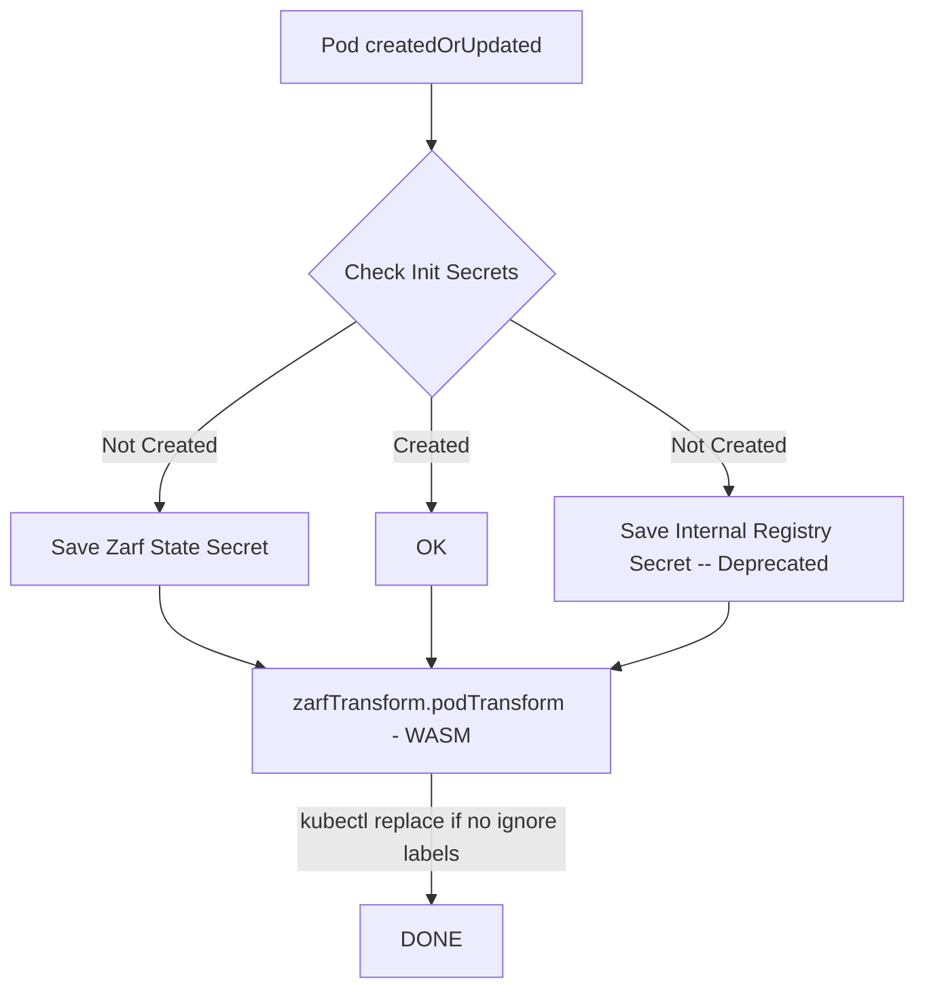

# Pepr Module

High Level Overview Demo

You must be running a k3d cluster. `k3d cluster create`  

```bash
git clone https://github.com/defenseunicorns/pepr-zarf-agent.git
cd pepr-zarf-agent
# replace docker username and login before make
make build/wasm-transform
# deploy zarf secrets
sh zarf-deps.sh
# in a JavaScript Debug Terminal
npx pepr dev --confirm

# create a pod in a new terminal
kubectl run demo --image=nginx

kubectl get po demo -oyaml |egrep -b3 'image|imagePullSecret|labels'
```

output (See Zarf's transform mutate the pod in WASM)

```bash
35-  annotations:
50-    f64b6d4f-93ec-54d3-99a4-e70c751da008.pepr.dev/zarf-agent: succeeded
122-  creationTimestamp: "2023-07-24T21:47:22Z"
166:  labels:
176-    run: demo
190-    zarf-agent: patched
214-  name: demo
--
273-  uid: 85c07ac6-68ba-4fb0-afce-c2174fa6eed1
317-spec:
323-  containers:
337:  - image: 127.0.0.1:31999/library/nginx:latest-zarf-3793515731
401:    imagePullPolicy: Always
429-    name: demo
444-    resources: {}
462-    terminationMessagePath: /dev/termination-log
--
661-      readOnly: true
682-  dnsPolicy: ClusterFirst
708-  enableServiceLinks: true
735:  imagePullSecrets:
755-  - name: private-registry
782-  nodeName: k3d-k3s-default-server-0
819-  preemptionPolicy: PreemptLowerPriority
--
2339-    status: "True"
2358-    type: PodScheduled
2381-  containerStatuses:
2402:  - image: 127.0.0.1:31999/library/nginx:latest-zarf-3793515731
2466:    imageID: ""
2482-    lastState: {}
2500-    name: demo
2515-    ready: false
--
2552-    started: false
2571-    state:
2582-      waiting:
2597:        message: Back-off pulling image "127.0.0.1:31999/library/nginx:latest-zarf-3793515731"
2692-        reason: ImagePullBackOff
2725-  hostIP: 172.21.0.3
2746-  phase: Pending
```


- [High Level Overview](#high-level-overview)
- [Contributing](#contributing)
- [Developing](#developing)

## High Level Overview



## Contributing

- Create PRs to the main branch
- Create issues for bugs or feature requests
- Create a new branch for each PR corresponding to issue number 
- Write unit tests to prove logic
- Sign commits with a key and include a [descriptive commit message](./.github/workflows/pr.yaml)


[TOP](#pepr-module)

