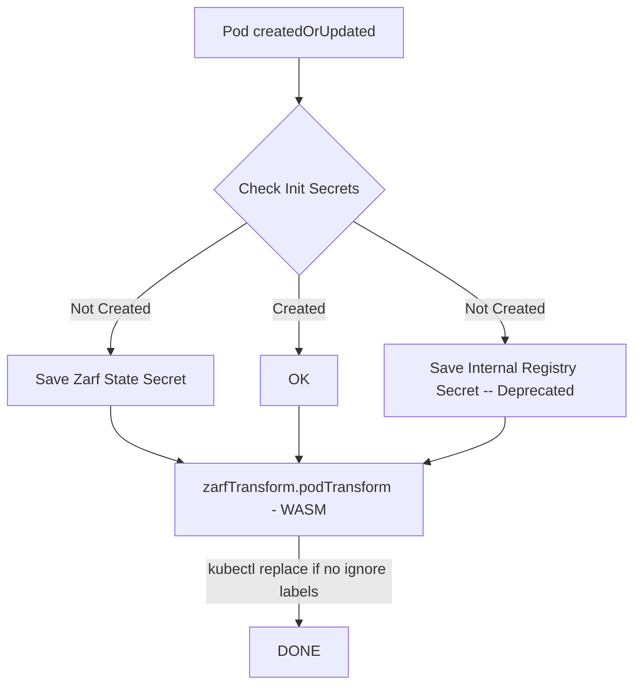

# Pepr Module

High Level Overview Demo

You must be running a k3d cluster. `k3d cluster create`  

```bash
git clone https://github.com/defenseunicorns/pepr-zarf-agent.git
cd pepr-zarf-agent
# replace docker username and login before make
make build/wasm-transform
# deploy zarf secrets
sh zarf-deps.sh
# in a JavaScript Debug Terminal
npx pepr dev --confirm

# create a pod in a new terminal
kubectl run demo --image=nginx

kubectl get po demo -oyaml |egrep -b3 'image|imagePullSecret|labels'
```

output (See Zarf's transform mutate the pod in WASM)

```bash
35-  annotations:
50-    f64b6d4f-93ec-54d3-99a4-e70c751da008.pepr.dev/zarf-agent: succeeded
122-  creationTimestamp: "2023-07-24T21:47:22Z"
166:  labels:
176-    run: demo
190-    zarf-agent: patched
214-  name: demo
--
273-  uid: 85c07ac6-68ba-4fb0-afce-c2174fa6eed1
317-spec:
323-  containers:
337:  - image: 127.0.0.1:31999/library/nginx:latest-zarf-3793515731
401:    imagePullPolicy: Always
429-    name: demo
444-    resources: {}
462-    terminationMessagePath: /dev/termination-log
--
661-      readOnly: true
682-  dnsPolicy: ClusterFirst
708-  enableServiceLinks: true
735:  imagePullSecrets:
755-  - name: private-registry
782-  nodeName: k3d-k3s-default-server-0
819-  preemptionPolicy: PreemptLowerPriority
--
2339-    status: "True"
2358-    type: PodScheduled
2381-  containerStatuses:
2402:  - image: 127.0.0.1:31999/library/nginx:latest-zarf-3793515731
2466:    imageID: ""
2482-    lastState: {}
2500-    name: demo
2515-    ready: false
--
2552-    started: false
2571-    state:
2582-      waiting:
2597:        message: Back-off pulling image "127.0.0.1:31999/library/nginx:latest-zarf-3793515731"
2692-        reason: ImagePullBackOff
2725-  hostIP: 172.21.0.3
2746-  phase: Pending
```


- [High Level Overview](#high-level-overview)
- [Contributing](#contributing)
- [Developing](#developing)

## High Level Overview




Clean Up

```bash
cd $WORKING_DIR
kind delete cluster --name=pepr-zarf-agent
rm -rf /tmp/zarf /tmp/hello-zarf
```

## Demo

_This flow creates a namespace, create a new pod in the namespace, and then checks the pod for the imagePullSecret and the internal registry image, and looks at the imagePullSecret._

**To test w/out Zarf uncomment everything under `Uncomment for testing w/out Zarf` in the zarf-agent and rebuild and redeploy**

```bash
┌─[cmwylie19@Cases-MacBook-Pro] - [~/pepr-zarf-agent] - [2023-06-26 09:55:12]
└─[0] <git:(tree-shake 0f8d000✱✈) > k create ns new-ns
namespace/new-ns created
┌─[cmwylie19@Cases-MacBook-Pro] - [~/pepr-zarf-agent] - [2023-06-26 09:55:19]
└─[0] <git:(tree-shake 0f8d000✱✈) > k run new-po -n new-ns --image=nginx
pod/new-po created
┌─[cmwylie19@Cases-MacBook-Pro] - [~/pepr-zarf-agent] - [2023-06-26 09:56:25]
└─[0] <git:(tree-shake 0f8d000✱✈) > k get po new-po -n new-ns -oyaml | egrep -A2 -b2 'imagePullSecret|patched|image'
35-  annotations:
50-    f64b6d4f-93ec-54d3-99a4-e70c751da008.pepr.dev/zarf-agent: succeeded
122:    zarg-agent/dev: patched
150-  creationTimestamp: "2023-06-26T13:56:25Z"
194-  labels:
--
324-spec:
330-  containers:
344:  - image: 127.0.0.1:31999/library/nginx
385:    imagePullPolicy: Always
413-    name: new-po
430-    resources: {}
--
668-  dnsPolicy: ClusterFirst
694-  enableServiceLinks: true
721:  imagePullSecrets:
741-  - name: private-registry
768-  nodeName: kind-control-plane
--
2342-    type: PodScheduled
2365-  containerStatuses:
2386:  - image: 127.0.0.1:31999/library/nginx
2427:    imageID: ""
2443-    lastState: {}
2461-    name: new-po
┌─[cmwylie19@Cases-MacBook-Pro] - [~/pepr-zarf-agent] - [2023-06-26 09:56:30]
└─[0] <git:(tree-shake 0f8d000✱✈) > k apply -f -<<EOF
apiVersion: v1
kind: Pod
metadata:
  creationTimestamp: null
  labels:
    run: initpo
  name: initpo
  namespace: new-ns
spec:
  initContainers: 
  - name: init
    image: nginx
  containers:
  - image: nginx
    name: container
    resources: {}
  dnsPolicy: ClusterFirst
  restartPolicy: Always
status: {}
EOF

pod/initpo created
┌─[cmwylie19@Cases-MacBook-Pro] - [~/pepr-zarf-agent] - [2023-06-26 09:56:46]
└─[0] <git:(tree-shake 0f8d000✱✈) > k get po initpo -n new-ns -oyaml | egrep -A2 -b2 'imagePullSecret|patched|image'
50-    f64b6d4f-93ec-54d3-99a4-e70c751da008.pepr.dev/zarf-agent: succeeded
122-    kubectl.kubernetes.io/last-applied-configuration: |
178:      {"apiVersion":"v1","kind":"Pod","metadata":{"annotations":{},"creationTimestamp":null,"labels":{"run":"initpo"},"name":"initpo","namespace":"new-ns"},"spec":{"containers":[{"image":"nginx","name":"container","resources":{}}],"dnsPolicy":"ClusterFirst","initContainers":[{"image":"nginx","name":"init"}],"restartPolicy":"Always"},"status":{}}
526:    zarg-agent/dev: patched
554-  creationTimestamp: "2023-06-26T13:56:46Z"
598-  labels:
--
728-spec:
734-  containers:
748:  - image: 127.0.0.1:31999/library/nginx
789:    imagePullPolicy: Always
817-    name: container
837-    resources: {}
--
1075-  dnsPolicy: ClusterFirst
1101-  enableServiceLinks: true
1128:  imagePullSecrets:
1148-  - name: private-registry
1175-  initContainers:
1193:  - image: 127.0.0.1:31999/library/nginx
1234:    imagePullPolicy: Always
1262-    name: init
1277-    resources: {}
--
3190-    type: PodScheduled
3213-  containerStatuses:
3234:  - image: 127.0.0.1:31999/library/nginx
3275:    imageID: ""
3291-    lastState: {}
3309-    name: container
--
3443-  hostIP: 172.18.0.2
3464-  initContainerStatuses:
3489:  - image: 127.0.0.1:31999/library/nginx
3530:    imageID: ""
3546-    lastState: {}
3564-    name: init
┌─[cmwylie19@Cases-MacBook-Pro] - [~/pepr-zarf-agent] - [2023-06-26 09:57:12]
└─[0] <git:(tree-shake 0f8d000✱✈) > k get secret private-registry -n new-ns -oyaml
apiVersion: v1
data:
  .dockerconfigjson: eyJhdXRocyI6eyIxMjcuMC4wLjE6MzE5OTkiOnsiYXV0aCI6ImVtRnlaaTF3ZFd4c09qVXpjMnhCVVRsUFMxaFJiVEYrUjBweFpHNUhlRForYlE9PSJ9fX0=
kind: Secret
metadata:
  creationTimestamp: "2023-06-26T13:56:25Z"
  name: private-registry
  namespace: new-ns
  resourceVersion: "636"
  uid: 87fcabd5-63a5-4b54-bb80-c6f65c3b11ca
type: Opaque
```

## Unit Test

```bash
$ npx jest
  console.log
    [info]              Checking init secrets

      at Logger.log (node_modules/pepr/src/lib/logger.ts:121:17)

  console.log
    [info]              Init secrets not initialized

      at Logger.log (node_modules/pepr/src/lib/logger.ts:121:17)

  console.log
    [info]              Checking init secrets

      at Logger.log (node_modules/pepr/src/lib/logger.ts:121:17)

  console.log
    [info]              Init secrets initialized

      at Logger.log (node_modules/pepr/src/lib/logger.ts:121:17)

 PASS  capabilities/helpers.test.ts
  InitSecretsReady function
    ✓ returns false when secrets are not initialized (18 ms)
    ✓ returns true when secrets are initialized (3 ms)
  HasIgnoreLabels function
    ✓ returns false when pod has no ignore labels
    ✓ returns true when pod has ignore labels
  BuildInternalImageURL
    ✓ should build the internal image URL correctly for a three-section image
    ✓ should throw an error for a malformed image (6 ms)
    ✓ should build the internal image URL correctly for a one-section image
  checkPattern
    ✓ should return true if the beginning string matches the pattern
    ✓ should return false if the beginning string does not match the pattern
  ParseAnyReference
    ✓ parses valid image references correctly (1 ms)
  GetCRCHash
    ✓ creates the correct crc32 hashes
  ImageTransformHost
    ✓ transforms valid image references correctly
    ✓ throws errors for invalid image references (1 ms)
  ImageTransformHostWithoutChecksum
    ✓ transforms valid image references correctly (1 ms)
    ✓ throws errors for invalid image references

Test Suites: 1 passed, 1 total
Tests:       15 passed, 15 total
Snapshots:   0 total
Time:        0.968 s, estimated 2 s
Ran all test suites.
```

## Fast Restart

**Terminal 1**

(This can be done by running `./rebuild.sh`)

- Delete the kind clusters
- Prune the images (personal preference)
- Build the Pepr module
- Deploy the Pepr module
- Wait for the hook pods to be ready
- Tail the logs of the hook pods

**Terminal 2**

(This can be done by running `./zarf-deps.sh`)

- Create zarf namespace
- Create zarf-state secret
- Create internal-registry secret

```bash
# terminal 1
./rebuild.sh

# terminal 2
./zarf-deps.sh
```

## Lint

Lint the code

```bash
npx prettier --write .
```


## Contributing

- Create PRs to the main branch
- Create issues for bugs or feature requests
- Create a new branch for each PR corresponding to issue number 
- Write unit tests to prove logic
- Sign commits with a key and include a [descriptive commit message](./.github/workflows/pr.yaml)


[TOP](#pepr-module)

