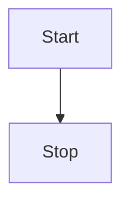

# Pepr Module

- [High Level Overview](#high-level-overview)
- [Check List](#check-list)
- [Unit Test](#unit-test)
- [Fast Restart](#fast-restart)
- [Lint](#lint)

## High Level Overview




## Check List

Step 1: (Initialization Phase)

- [x] Get Zarf State from secret and store in state
- [x] Get private-registry secret and store in state

Step 2: (Pre-Mutation Phase)

- [x] Get Pod without ignore labels/annotations
- [x] Deploy private-registry secret to pod namespace

Step 3: (Mutation Phase)

- [x] Mutate pod with imagePullSecret
- [x] Mutate pod with internal registry image
- [x] Annotate pod `zarg-agent: patched`

Step 4: Implement transform pkg for TypeScript with Tests

- [x] Images

```bash
┌─[cmwylie19@Cases-MacBook-Pro] - [~/pepr-zarf-agent] - [2023-06-23 09:02:14]
└─[0] <git:(main 0d82765✱) > k create ns new-ns
namespace/new-ns created
┌─[cmwylie19@Cases-MacBook-Pro] - [~/pepr-zarf-agent] - [2023-06-23 09:02:19]
└─[0] <git:(main 0d82765✱) > k run new-po -n new-ns --image=nginx
pod/new-po created
┌─[cmwylie19@Cases-MacBook-Pro] - [~/pepr-zarf-agent] - [2023-06-23 09:02:26]
└─[0] <git:(main 0d82765✱) > k get po new-po -n new-ns -oyaml | egrep -A2 -b2 'imagePullSecret|patched|image'
35-  annotations:
50-    f64b6d4f-93ec-54d3-99a4-e70c751da008.pepr.dev/zarf-agent: succeeded
122:    zarg-agent/dev: patched
150-  creationTimestamp: "2023-06-23T13:02:26Z"
194-  labels:
--
324-spec:
330-  containers:
344:  - image: 127.0.0.1:31999/library/nginx
385:    imagePullPolicy: Always
413-    name: new-po
430-    resources: {}
--
668-  dnsPolicy: ClusterFirst
694-  enableServiceLinks: true
721:  imagePullSecrets:
741-  - name: private-registry
768-  nodeName: kind-control-plane
--
2342-    type: PodScheduled
2365-  containerStatuses:
2386:  - image: 127.0.0.1:31999/library/nginx
2427:    imageID: ""
2443-    lastState: {}
2461-    name: new-po
--
2534-    state:
2545-      waiting:
2560:        message: 'rpc error: code = Unknown desc = failed to pull and unpack image
2643-          "127.0.0.1:31999/library/nginx:latest": failed to resolve reference "127.0.0.1:31999/library/nginx:latest":
2761-          failed to do request: Head "http://127.0.0.1:31999/v2/library/nginx/manifests/latest":
┌─[cmwylie19@Cases-MacBook-Pro] - [~/pepr-zarf-agent] - [2023-06-23 09:02:32]
└─[0] <git:(main 0d82765✱) > k get secret private-registry -n new-ns -oyaml
apiVersion: v1
data:
  .dockerconfigjson: eyJhdXRocyI6eyIxMjcuMC4wLjE6MzE5OTkiOnsiYXV0aCI6ImVtRnlaaTF3ZFd4c09qVXpjMnhCVVRsUFMxaFJiVEYrUjBweFpHNUhlRForYlE9PSJ9fX0=
kind: Secret
metadata:
  creationTimestamp: "2023-06-23T13:02:26Z"
  name: private-registry
  namespace: new-ns
  resourceVersion: "872"
  uid: a1d0f5fb-049c-422c-a2dd-06e73bec8ee4
type: Opaque
```

## Unit Test

```bash
$ npx test
  console.log
    [info]              Checking init secrets

      at Logger.log (node_modules/pepr/src/lib/logger.ts:121:17)

  console.log
    [info]              Init secrets not initialized

      at Logger.log (node_modules/pepr/src/lib/logger.ts:121:17)

  console.log
    [info]              Checking init secrets

      at Logger.log (node_modules/pepr/src/lib/logger.ts:121:17)

  console.log
    [info]              Init secrets initialized

      at Logger.log (node_modules/pepr/src/lib/logger.ts:121:17)

 PASS  capabilities/helpers.test.ts
  InitSecretsReady function
    ✓ returns false when secrets are not initialized (18 ms)
    ✓ returns true when secrets are initialized (3 ms)
  HasIgnoreLabels function
    ✓ returns false when pod has no ignore labels
    ✓ returns true when pod has ignore labels
  BuildInternalImageURL
    ✓ should build the internal image URL correctly for a three-section image
    ✓ should throw an error for a malformed image (6 ms)
    ✓ should build the internal image URL correctly for a one-section image
  checkPattern
    ✓ should return true if the beginning string matches the pattern
    ✓ should return false if the beginning string does not match the pattern
  ParseAnyReference
    ✓ parses valid image references correctly (1 ms)
  GetCRCHash
    ✓ creates the correct crc32 hashes
  ImageTransformHost
    ✓ transforms valid image references correctly
    ✓ throws errors for invalid image references (1 ms)
  ImageTransformHostWithoutChecksum
    ✓ transforms valid image references correctly (1 ms)
    ✓ throws errors for invalid image references

Test Suites: 1 passed, 1 total
Tests:       15 passed, 15 total
Snapshots:   0 total
Time:        0.968 s, estimated 2 s
Ran all test suites.
```

## Fast Restart

**Terminal 1*

(This can be done by running `./rebuild.sh`)
- Delete the kind clusters
- Prune the images (personal preference)
- Build the Pepr module
- Deploy the Pepr module
- Wait for the hook pods to be ready
- Tail the logs of the hook pods

**Terminal 2**  

(This can be done by running `./zarf-deps.sh`)
- Create zarf namespace
- Create zarf-state secret
- Create internal-registry secret

```bash
# terminal 1
kind delete clusters --all;
docker image prune -a -f;
kind create cluster
pepr build;k create -f dist;k delete po -n pepr-system --all --force; sleep 35;k wait --for=condition=Ready pod -l app -n pepr-system --timeout=180s;k logs deploy/$(kubectl get deployments --output=jsonpath='{.items[0].metadata.name}' -n pepr-system) -f -n pepr-system

# terminal 2
k create ns zarf

k create -f -<<EOF
apiVersion: v1
data:
  state: eyJ6YXJmQXBwbGlhbmNlIjpmYWxzZSwiZGlzdHJvIjoia2luZCIsImFyY2hpdGVjdHVyZSI6ImFybTY0Iiwic3RvcmFnZUNsYXNzIjoic3RhbmRhcmQiLCJhZ2VudFRMUyI6eyJjYSI6IkxTMHRMUzFDUlVkSlRpQkRSVkpVU1VaSlEwRlVSUzB0TFMwdENrMUpTVVJYVkVORFFXdEhaMEYzU1VKQlowbFJaRmRHZURoRFJrRkpjM0kwUkZCTVIwOVhOamxXUkVGT1FtZHJjV2hyYVVjNWR6QkNRVkZ6UmtGRVFUTUtUVkpqZDBaUldVUldVVkZMUlhjMVlWbFlTbTFKUlU1MllsY3hNV0p0YkRCbFZFVmpUVUp2UjBFeFZVVkJlRTFVV1RKRmRXTklTbkJrYlVZd1dsTTFOZ3BaV0VwdFRHMVNiR1JxUVdWR2R6QjVUWHBCTWsxVVozaE9WRUY0VFZSR1lVWjNNSGxPUkVFeVRXcGplRTVVUVhoTlZFWmhUVVJqZUVaNlFWWkNaMDVXQ2tKQmIxUkViSEJvWTIxWloxRXlPWFJpV0ZaMVlWaFNOVTFTZDNkSFoxbEVWbEZSUkVWNFRtcFpVelYzWTIxc01sbFlVbXhNYm5Cb1kyMVpkVnBIVmpJS1RVbEpRa2xxUVU1Q1oydHhhR3RwUnpsM01FSkJVVVZHUVVGUFEwRlJPRUZOU1VsQ1EyZExRMEZSUlVGd1VXeFJUbW9yYjNOdGNrNVZhWFZZV0dRNWRBcGFUbFE1VG5SM00zTlJjbkpZT1ZscFdVdzJZV2RGVEdoR1ltbElURXhxV0RrdlJGZHZjQ3QzWlZWTmMyOXVZVTVrVG5jdlVtWnNVbU12YjA1MlVUaFlDakkxUzFOSlVtVjBSRk5rV2xOSFVGUlRaMnR4WlVKcVZtZEVlVUpRUlRsWFMweFNLMmxxTUM5b01FZzVibFpzVjNod1NFZGxTRWR2Wms1SWJGaFpWMllLZDNCQmJtSjJiV3RUYjJkWWFHTm1kVlZHT1ZwSFJrdE9SbkJGWXk5T1Z6VlFUbUkwYjFWS01tZEdRMFJJWm5WSVExSXZObkIwTVV0dmQyaHFXaXRqTlFwbmNVcHphV0psWXpVNVMxWldMMmswVjFoNFdqTkJiMlZLTUZoeGFERmpNMVJrY2xFM0t6SnJlR053WkRCS1RYcDJVVXRoYUZGS00yRkZSSFp1TWtsMENubHBlbTFuYlRCWVkxQlZWWEZUZW5rM09HTTVTV05qTDA0NGVXOVpOVTVUTTFGd1VXMXJhVUZZVjNBeVlWbEZNakZZTkVSSk9GQTJiSHBYUjB3M01FUUthRkZKUkVGUlFVSnZNa1YzV0hwQlQwSm5UbFpJVVRoQ1FXWTRSVUpCVFVOQmIxRjNTRkZaUkZaU01HeENRbGwzUmtGWlNVdDNXVUpDVVZWSVFYZEZSd3BEUTNOSFFWRlZSa0ozVFVOTlFUaEhRVEZWWkVWM1JVSXZkMUZHVFVGTlFrRm1PSGRJVVZsRVZsSXdUMEpDV1VWR1FUaFJaWG94VTNGcWVVRjNhV05vQ2pkak5WVlNkWEYxV1VWUllVMUJNRWREVTNGSFUwbGlNMFJSUlVKRGQxVkJRVFJKUWtGUlEyb3ZPRmd3UW5CWlZuTmpaV1pJY0dOV1VWQk5XV1EwU1VFS1dtdFFkbU5DZVhKR1RqQnZUMjlVZUhWYWFteExURmswZERKUFJYQk5hVVphVVZOSGJraGpjR1p3T0VORE0zSm5NMUJaWjJoSGJuWm5ValUxY1VkcFp3bzBjVzExVXpCTVYzcDRkRVp0ZVZNd1RUWjNXSGM1V1ZKdVIwbHBkVTUyU2psTVlYbDFiVTFtS3poVmFWTTFPSGxyWnpKUFIzSjVVM05yTmpkdWQySm9DblpFV0hFclRtOXlNblp6VjJGWWFWVjBXWEIwU1d0Tk1HeDNZbEp4ZVRSbGQwZzRWM1Z5UlZCV1ZYTmthbWxLUmtWdWJ6WXhiWEZzVVd0RGFWSlFXbElLYjFGNWVtWTFhRFZ0VGtOTE5GUXdVbXRIV0VWeFEwcGxaRGRPWnpSRk5WaHhiRTFMYWxSNmVtWjVkMmt6VTJwV2FWcEJWMmxOY1cxT2RWTTROWGhrTkFvdlJHVnVPVmh1YzJ4NUwzbFhja2RHU0VOdmFISjJNSHBVWWxCRU0zSlhiV3BsVEZwdldFWlRXVzA1UjFSd1REUTVUM3B2V0dSb1QxTmhkSEVLTFMwdExTMUZUa1FnUTBWU1ZFbEdTVU5CVkVVdExTMHRMUW89IiwiY2VydCI6IkxTMHRMUzFDUlVkSlRpQkRSVkpVU1VaSlEwRlVSUzB0TFMwdENrMUpTVVJqYWtORFFXeHhaMEYzU1VKQlowbFJaV294WWtodFNTdGxZMXBuTkV4VmRrdHVabUZMVkVGT1FtZHJjV2hyYVVjNWR6QkNRVkZ6UmtGRVFUTUtUVkpqZDBaUldVUldVVkZMUlhjMVlWbFlTbTFKUlU1MllsY3hNV0p0YkRCbFZFVmpUVUp2UjBFeFZVVkJlRTFVV1RKRmRXTklTbkJrYlVZd1dsTTFOZ3BaV0VwdFRHMVNiR1JxUVdWR2R6QjVUWHBCTWsxVVozaE9WRUY0VFZSS1lVWjNNSGxPUkVFeVRXcGplRTVVUVhoTlZFcGhUVVJWZUVaVVFWUkNaMDVXQ2tKQmIxUkVSbkJvWTIxWloxRXllREZqTTFKc1kycEZZMDFDYjBkQk1WVkZRWGhOVkZsWFpHeGlibEYwWVVjNWRtRjVOVFpaV0VwdFRHNU9NbGw2UTBNS1FWTkpkMFJSV1VwTGIxcEphSFpqVGtGUlJVSkNVVUZFWjJkRlVFRkVRME5CVVc5RFoyZEZRa0ZPZURaM1NqTjZWRmx5YWxGbFUyaFBOWGxNTmpGUVp3cDZVbWRKSzFSTFEzSk9Ubko2Y1ZCV1dUWlBPV0p0Wm5STWRYVkVLMFJIV1U4M1NITk9UMXBTTmxoT1IxQkZjMHBKUjNaV05HVnFVM2RRYUdGWGFqWkRDbTFUVGpFMFEwTldSR05CVEhWbllrRkhkM1pOTmpBNGExSjRLemQ0WmxwdlJXdHlSV3BMY1hkdk56Wk1jMDlTU3pWa1IzQjVaa3RWTDBGdVRUQlhaMFFLWkUxeVNqUm5WbEp6U2pWYWFWY3ZWVWxNZEVKbGJ6SkZZM0JLVWxoQ2VtY3JZamt3VEhRM1pXVnhSRzlqVDNkdVVUTnVVblJ2VTFSSFUyWXhZWEJZWlFwSVdHSmlaV2tyTkRnMFFUSldRVGQyV214M1IzRkJNVTl4UTNBclNYUkJNRkZ1VEc5Rk5FRXpVSGN2SzJ3d05tbEhkMFZWZUVkblVuSkNPVTFPU2pONENsaEZUVzFDT1VnM05IUm9lazVxZERVemFXMUJabU51VDJrNGNtaGxXVGRzT0dObFpWQlVUWHBVU3poVGVYRktiRlpCY1VFeFNIaEdTVWRUTHpSalJVTUtRWGRGUVVGaFRqaE5TRzkzUkdkWlJGWlNNRkJCVVVndlFrRlJSRUZuVjJkTlFrMUhRVEZWWkVwUlVVMU5RVzlIUTBOelIwRlJWVVpDZDAxQ1RVRjNSd3BCTVZWa1JYZEZRaTkzVVVOTlFVRjNTSGRaUkZaU01HcENRbWQzUm05QlZVUjRRamRRVmt0eFVFbEVRMHA1U0hSNmJGSkhObkUxWjFKQ2IzZEtRVmxFQ2xaU01GSkNRakIzUnpSSlZGbFhaR3hpYmxGMFlVYzVkbUY1TlRaWldFcHRURzVPTWxrMFkwVm1kMEZCUVZSQlRrSm5hM0ZvYTJsSE9YY3dRa0ZSYzBZS1FVRlBRMEZSUlVGSUwwNHlZakUyU0N0dlpqbEVlWGxWY3l0aloyNW5VSHBrV20xcGVEaHBWRkV2Y25wdmFFSjJhbWxZYVRCellVZHdXR0ZyYURJMFRRcHRPRUV6VWtkck9YcGlaV0pGYldsMVRITnBXRUZXYnk5MFRVcFJhVEZPZW5neGFVeFFhWE13ZWpKWVF6UnhVek50Wmt0SlNHdG1NRUl2ZEN0SE4yOXVDaTkxVFZndlFUSkNUemxIY1dKamMzcHJhRmQyWmxrMWFHRjBWRFJSUjJFemFFbDVXblpEZDFwSlFXZDBhblF6UmpVd1MwMWlZVE5rUzFoTWNrMVlZVzhLVFRSaVFWbEpaM001V1hsb09XUlpibkZEY1hOdE4zaFdTRTltT1RKTmMyOHZWRGh5UWxJd016bEhOemhSY1VweGVuTXZkMlZFV1RSb1JYZFNlbFJQTUFwWFNXTlJUalZpZGpSTlRsQTJSMHAyVmxOa05uVnhLMFpGYVV4WFYzb3lWbmRtVkdwQmJHYzNRM2N5Y1VKWU5HcGFLelJpZHpRMGFEVnlWRWxrZUVNdkNtbEdhMkU1UWtJeGRGbG9NMnRHTjFoUVVIbFVaV0pxVGt4bFlsYzRRVDA5Q2kwdExTMHRSVTVFSUVORlVsUkpSa2xEUVZSRkxTMHRMUzBLIiwia2V5IjoiTFMwdExTMUNSVWRKVGlCU1UwRWdVRkpKVmtGVVJTQkxSVmt0TFMwdExRcE5TVWxGYjNkSlFrRkJTME5CVVVWQk0waHlRVzVtVGs1cGRVNUNOVXRGTjI1SmRuSlZLMFJPUjBGcU5VMXZTM013TW5aUGJ6bFdhbTgzTVhWYUt6QjFDalkwVURSTldtYzNjMlYzTURWc1NIQmpNRms0VTNkcloyRTVXR2cyVGt4QkswWndZVkJ2UzFwSk0xaG5TVXBWVG5kQmRUWkNjMEZpUXpoNmNsUjVVa2dLU0RkMlJqbHRaMU5UYzFOTmNYSkRhblp2ZFhjMVJYSnNNR0Z1U2pod1ZEaERZM3BTWVVGT01IbHpibWxDVmtkM2JteHRTbUk1VVdkMU1FWTJhbGxTZVFwcmJFWmpTRTlFTlhZelVYVXpkRFUyYjA5b2R6ZERaRVJsWkVjeWFFcE5Xa292Vm5Gc1pEUmtaSFIwTmt3M2FucG5SRnBWUkhVNWJWaEJZVzlFVlRadkNrdHVOR2t3UkZKRFkzVm5WR2RFWXk5RUx6WllWSEZKWWtGU1ZFVmhRa2R6U0RCM01HNW1SbU5SZVZsSU1HWjJhVEpJVFRKUE0yNWxTMWxDT1hsak5rd0tlWFZHTldwMVdIaDROVFE1VFhwT1RYSjRURXR2YlZaVlEyOUVWV1pGVldkYVRDOW9kMUZKUkVGUlFVSkJiMGxDUVVSRVpWUkdPREpHUmxCaFpIcHdlZ3AxYTBSRGFYQkNNak5VTm1OcWJ6bDRaekZyUWtwcVdVOUZRakl3TWxGdVZDdHVhR1JOWkM5alVFTTNPV2xsVVdFNU9FZEVTMk16THpSa00wVTVSMDlyQ21kMk1FcEhZMDlPVFhWQk0wOXJkeXRtVjA4MWRHRjJWbGhMYkVzM1JWVkpXak5PVkV4V1pXMVVXbVZuTlZGVVdWUm9URzQxTTJSVFYyOXZWVTVvZVRnS2FGQnBka2Q1VFZFd1VYYzFibmN4UzNjdmFqRkpORGxVTVRCV2NHNXVNV0pFZEhjMlpuVlNUMHRDVjJaS1duRnZOR3BHVWtGTlpYUnlVbXhTWm0xUVRBb3dkMm81TTNkQlNEZG9kamRWWldKb1lrbGhUVmhqTURWcVJreHpUek16U2t4S2RpOVNVR1k0Y1RVdmR6Rk9XR0YzZEdzMVJUZDBOVEE1YUV3MWFUQlZDblJNV0RCYU56UmhWVEpxWVcxaGNUZzRibWdyTmxCMU56WkZNRzB3YVZncmRHTnpUWEZ2UTFacU5pOVhhVWhhTjJjeFdscFpUQzlFWlVZMlpFVkxNbVFLVEc1VU9YTm1hME5uV1VWQk16bDVTVk5oZDBodWRVWkJkV3QxWVhKc2FHMDViVlpuTm5oWGFTdE9RalV3WlRBMlZVVmlOM0ZRZERCVlNHdFBUaTlwYndvM05XTnFUSEUwY0ZreE5TOVhTMUJxWlcxU0x6VnZORGR4VjBWaVdqWllWaXRHY0VSTloyWXpOVEp6VUhoeGRYSjJkVXQ1TVhwbVdITmpTbUZNTVVoeUNubERXbFZyYUhReU1sWm1RbGh3VWxnMFRVTnNSVXB1TTAxNFVtWkJUMFZoZUdJNE1tWkZjVU16TnpSeFVYSnJUVEYxYlZwWFl6aERaMWxGUVM5RFNITUtkMDFITDJjdlJYcGFaR04zYVc1bWJYUk5lWGNyVFZKVFQyaDZlR2xzV0RGd04wcHNOMmN3ZVZrNFpTdEpPRWxPZW1ncmVFMURTeklyUW1NeWR6RXZhZ28xU3prME5tVlllV1ZOVnpaYWEzaG5WMDgzVm1KVGJHZ3laVVU1ZWxKNmFuRkRNRXBGV1VNeE4wNXdTalJXZG1wa1kycERXRFEzV2t4bmIzaFdZMGhPQ21Nd2FVTmtSR0U0TlhCT1IwazBXVzlCVUdOS01ETlBaWGgzVjFOYVdFaHZVRlpHV1ZBeU9FTm5XVUYzYW1vMFJtUk5ibTFZVldSVU5GTm5ORE55V0dVS2FHUnFRM2hPZFc1cGJHbFNMM2h0YURWbVQyRkZTV2xJUml0eVRXMTVVRkpoTHk5WGJGUkpiU3R2TURKd1lqSnRaek4yTW1aNU1WUnlUblJ5TTA0eVVBcFZPSGt4V1cxTlZVUXZXRXBEZERGcGRIWjBRbXRVZHpSek1GbHhZekpPYmpneVFuVnVTVkp1TW1jdk5FOXpZbWN5WjJkNmJFdEhOSE0xWkhwemJDOUVDazl3YkZBeGFqSlRNa1ZYUlZkWGVpdG9TV0ZrYjNkTFFtZFJRMFpSVkZSTmNERnRaREZWVUZJMWEzQnpWa2hTYkZJck1tTm1URE56YjNSR2VIbElObVFLTUN0aFZsTjJieTk2UW1sTk9EUnRlVlZCVDI5eGFVSkVka3ByWmpWNlZXUTNlazlpWjNkSFJXNVNVVzQzZFZCWkwwNXNiRFpWU1dwRmFURkZhelpyY1FwblEzSlVlV3N2WTFRek5VOXJaVGhGYlVWa1MyczRabkV3YXpWRGQySjJaekozYVM5bVVrdFlWbTE2ZVZvemQweEViMVowT0ZOVFVXdFVlRkJUTUZaMkNqWjFZMWRHZDB0Q1owaHpaaTluTXpWWk1sSjJielZTVUZNeVZXbE1jRmhZU25VMWJXSkRSVGh2ZVRGT1lUTmhXVVIyZWpaSVl6aE1WM0ZSV0RKTGVUZ0tWekJzUVRWdlFXUTJOM001YWxob01VMDBUV1Z1YkVGbkt6RXdjamw0Y2xKVldpOXJUMEpxTUZaQlpuRXlUVzlRUmtKSU9HTnJZakZFZFdKcU5tVnVZUXB6VmxCcVlVaFlkamd5WXpob1dGZE9NV1JQTW5wUU4wcFNkM2xPVVhvMGRtdERNSE5WWkdkeFdURlNiakZTZWpBNGExbGhDaTB0TFMwdFJVNUVJRkpUUVNCUVVrbFdRVlJGSUV0RldTMHRMUzB0Q2c9PSJ9LCJnaXRTZXJ2ZXIiOnsicHVzaFVzZXJuYW1lIjoiemFyZi1naXQtdXNlciIsInB1c2hQYXNzd29yZCI6IkRITmdWdkhIOWRiQUE1dmNCZzNPa2NJISIsInB1bGxVc2VybmFtZSI6InphcmYtZ2l0LXJlYWQtdXNlciIsInB1bGxQYXNzd29yZCI6IlpaYnJpZFVJcXRVNnU1ekY5WkIyNWdmbyIsImFkZHJlc3MiOiJodHRwOi8vemFyZi1naXRlYS1odHRwLnphcmYuc3ZjLmNsdXN0ZXIubG9jYWw6MzAwMCIsImludGVybmFsU2VydmVyIjp0cnVlfSwicmVnaXN0cnlJbmZvIjp7InB1c2hVc2VybmFtZSI6InphcmYtcHVzaCIsInB1c2hQYXNzd29yZCI6ImM5RnduM1pneVZyWHF3SldXSko0bmVVSSIsInB1bGxVc2VybmFtZSI6InphcmYtcHVsbCIsInB1bGxQYXNzd29yZCI6IjUzc2xBUTlPS1hRbTF+R0pxZG5HeDZ+bSIsImFkZHJlc3MiOiIxMjcuMC4wLjE6MzE5OTkiLCJub2RlUG9ydCI6MzE5OTksImludGVybmFsUmVnaXN0cnkiOnRydWUsInNlY3JldCI6ImFCRH54LXA4Z0R6aG1TUWEwdGlQRFI0SEFCaFpZZUJSQVNYcU5IdjVWRGZVZUdoZiJ9LCJhcnRpZmFjdFNlcnZlciI6eyJwdXNoVXNlcm5hbWUiOiJ6YXJmLWdpdC11c2VyIiwicHVzaFBhc3N3b3JkIjoiIiwiYWRkcmVzcyI6Imh0dHA6Ly96YXJmLWdpdGVhLWh0dHAuemFyZi5zdmMuY2x1c3Rlci5sb2NhbDozMDAwL2FwaS9wYWNrYWdlcy96YXJmLWdpdC11c2VyIiwiaW50ZXJuYWxTZXJ2ZXIiOnRydWV9LCJsb2dnaW5nU2VjcmV0IjoiVTl6TFNhNXlZMk5TQ0xEITFhRi1BSUhpIn0=
kind: Secret
metadata:
  labels:
    app.kubernetes.io/managed-by: zarf
  name: zarf-state
  namespace: zarf
type: Opaque
EOF


k create -f -<<EOF
apiVersion: v1
data:
  .dockerconfigjson: eyJhdXRocyI6eyIxMjcuMC4wLjE6MzE5OTkiOnsiYXV0aCI6ImVtRnlaaTF3ZFd4c09qVXpjMnhCVVRsUFMxaFJiVEYrUjBweFpHNUhlRForYlE9PSJ9fX0=
kind: Secret
metadata:
  labels:
    app: zarf-injector
    app.kubernetes.io/managed-by: zarf
    zarf.dev/agent: ignore
  name: private-registry
  namespace: zarf
type: kubernetes.io/dockerconfigjson
EOF
```

## Lint

Lint the code

```bash
npx prettier --write .
```
