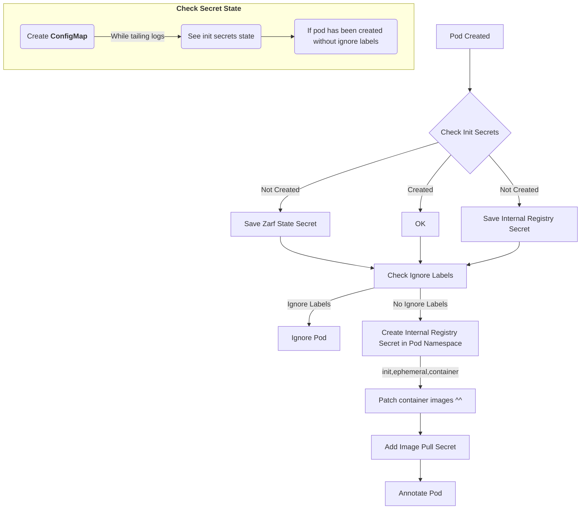

# Pepr Module

- [High Level Overview](#high-level-overview)
- [Check List](#check-list)
- [Demo](#demo)
- [Unit Test](#unit-test)
- [Fast Restart](#fast-restart)
- [Lint](#lint)

## High Level Overview



## Check List

Step 1: (Initialization Phase)

- [x] Get Zarf State from secret and store in state
- [x] Get private-registry secret and store in state

Step 2: (Pre-Mutation Phase)

- [x] Get Pod without ignore labels/annotations
- [x] Deploy private-registry secret to pod namespace

Step 3: (Mutation Phase)

- [x] Mutate pod with imagePullSecret
- [x] Mutate pod with internal registry image
- [x] Annotate pod `zarg-agent: patched`

Step 4: Implement transform pkg for TypeScript with Tests

- [x] Images

This flow creates a namespace, create a new pod in the namespace, and then checks the pod for the imagePullSecret and the internal registry image, and looks at the imagePullSecret.

## Demo
Warning: Needs improvement and is super raw..
```bash
┌─[cmwylie19@Cases-MacBook-Pro] - [~/pepr-zarf-agent] - [2023-06-23 09:02:14]
└─[0] <git:(main 0d82765✱) > k create ns new-ns
namespace/new-ns created
┌─[cmwylie19@Cases-MacBook-Pro] - [~/pepr-zarf-agent] - [2023-06-23 09:02:19]
└─[0] <git:(main 0d82765✱) > k run new-po -n new-ns --image=nginx
pod/new-po created
┌─[cmwylie19@Cases-MacBook-Pro] - [~/pepr-zarf-agent] - [2023-06-23 09:02:26]
└─[0] <git:(main 0d82765✱) > k get po new-po -n new-ns -oyaml | egrep -A2 -b2 'imagePullSecret|patched|image'
35-  annotations:
50-    f64b6d4f-93ec-54d3-99a4-e70c751da008.pepr.dev/zarf-agent: succeeded
122:    zarg-agent/dev: patched
150-  creationTimestamp: "2023-06-23T13:02:26Z"
194-  labels:
--
324-spec:
330-  containers:
344:  - image: 127.0.0.1:31999/library/nginx
385:    imagePullPolicy: Always
413-    name: new-po
430-    resources: {}
--
668-  dnsPolicy: ClusterFirst
694-  enableServiceLinks: true
721:  imagePullSecrets:
741-  - name: private-registry
┌─[cmwylie19@Cases-MacBook-Pro] - [~/pepr-zarf-agent] - [2023-06-23 09:02:32]
└─[0] <git:(main 0d82765✱) > k get secret private-registry -n new-ns -oyaml
apiVersion: v1
data:
  .dockerconfigjson: eyJhdXRocyI6eyIxMjcuMC4wLjE6MzE5OTkiOnsiYXV0aCI6ImVtRnlaaTF3ZFd4c09qVXpjMnhCVVRsUFMxaFJiVEYrUjBweFpHNUhlRForYlE9PSJ9fX0=
kind: Secret
metadata:
  creationTimestamp: "2023-06-23T13:02:26Z"
  name: private-registry
  namespace: new-ns
  resourceVersion: "872"
  uid: a1d0f5fb-049c-422c-a2dd-06e73bec8ee4
type: Opaque
```

## Unit Test

```bash
$ npx test
  console.log
    [info]              Checking init secrets

      at Logger.log (node_modules/pepr/src/lib/logger.ts:121:17)

  console.log
    [info]              Init secrets not initialized

      at Logger.log (node_modules/pepr/src/lib/logger.ts:121:17)

  console.log
    [info]              Checking init secrets

      at Logger.log (node_modules/pepr/src/lib/logger.ts:121:17)

  console.log
    [info]              Init secrets initialized

      at Logger.log (node_modules/pepr/src/lib/logger.ts:121:17)

 PASS  capabilities/helpers.test.ts
  InitSecretsReady function
    ✓ returns false when secrets are not initialized (18 ms)
    ✓ returns true when secrets are initialized (3 ms)
  HasIgnoreLabels function
    ✓ returns false when pod has no ignore labels
    ✓ returns true when pod has ignore labels
  BuildInternalImageURL
    ✓ should build the internal image URL correctly for a three-section image
    ✓ should throw an error for a malformed image (6 ms)
    ✓ should build the internal image URL correctly for a one-section image
  checkPattern
    ✓ should return true if the beginning string matches the pattern
    ✓ should return false if the beginning string does not match the pattern
  ParseAnyReference
    ✓ parses valid image references correctly (1 ms)
  GetCRCHash
    ✓ creates the correct crc32 hashes
  ImageTransformHost
    ✓ transforms valid image references correctly
    ✓ throws errors for invalid image references (1 ms)
  ImageTransformHostWithoutChecksum
    ✓ transforms valid image references correctly (1 ms)
    ✓ throws errors for invalid image references

Test Suites: 1 passed, 1 total
Tests:       15 passed, 15 total
Snapshots:   0 total
Time:        0.968 s, estimated 2 s
Ran all test suites.
```

## Fast Restart

**Terminal 1**

(This can be done by running `./rebuild.sh`)

- Delete the kind clusters
- Prune the images (personal preference)
- Build the Pepr module
- Deploy the Pepr module
- Wait for the hook pods to be ready
- Tail the logs of the hook pods

**Terminal 2**

(This can be done by running `./zarf-deps.sh`)

- Create zarf namespace
- Create zarf-state secret
- Create internal-registry secret

```bash
# terminal 1
./rebuild.sh

# terminal 2
./zarf-deps.sh
```

## Lint

Lint the code

```bash
npx prettier --write .
```
